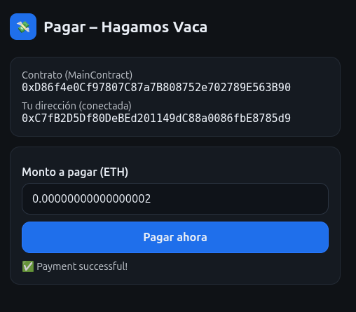

# 🐮 LetsCow  

**Smart Contracts for Fair Expense Sharing**  

---

## 📌 Overview  
Every time we go out with friends, one person usually pays the bill, and everyone else promises to pay their share later. But often, they forget, send the wrong amount, or the math just gets messy.  

**LetsCow** solves this problem by using **smart contracts** to automate expense sharing in a transparent, trustless, and reliable way.  

With LetsCow, you can:  
- Create a contract for any shared expense.  
- Define the total amount and the main account.  
- Invite friends and assign contributions (equal or proportional).  
- Generate a **summary with payment links** for each participant.  
- Enable seamless payments via **MetaMask**.  

No confusion. No excuses. Just fair and simple sharing.  

---

## 🚀 Features  
- **Smart-contract powered**: Full transparency and trustless execution.  
- **Flexible splitting**: Equal shares or custom proportional contributions.  
- **MetaMask integration**: Secure and familiar Web3 payments.  
- **Transaction summary**: Easy-to-share payment links with clear breakdown.  
- **User-friendly interface**: Simple enough for everyday use, powerful enough for blockchain enthusiasts.  

---

## 🛠️ Tech Stack  
- **Blockchain**: Solidity + Ethereum testnets  
- **Frontend**: HTML / CSS / JavaScript  
- **Wallet**: MetaMask integration  
- **Smart Contracts**: Custom contracts for expense distribution  

---

## 📷 Demo

  
  

  
  

  
  

  
  

  
  

  
  

  
  

---

## 👥 Team  
- Developers passionate about Web3  
- Hackers eager to make blockchain useful in daily life  
- Designers focused on simplicity and usability  

---

## 📅 Roadmap (General)  
1. ✅ Proof of concept with Solidity smart contracts  
2. ✅ Basic web interface + MetaMask connection  
3. 🚧 Add proportional contributions logic  
4. 🚧 Generate dynamic payment links  
5. 🚧 Improve UX/UI for non-technical users  
6. 🚀 Deploy MVP on Ethereum testnet (Goerli/Linea/Polygon testnets)  
7. 🌍 Prepare for mainnet release  

---

## 🔮 Next Steps  

- **Smart Contract Enhancements**  
  - Add support for recurring expenses (e.g., rent, subscriptions, memberships).  
  - Implement multi-token support (USDC, DAI, etc. in addition to ETH).  
  - Add penalty logic for late payments.  

- **Frontend Improvements**  
  - Build a React-based dApp for smoother user experience.  
  - Add QR code generation for easier sharing of payment links.  
  - Include real-time notifications when friends complete their payments.  

- **Security & Reliability**  
  - Conduct smart contract audits to ensure safety.  
  - Improve error handling for failed transactions.  

- **User Growth**  
  - Launch referral system to incentivize adoption.  
  - Add social features (friends list, expense history).  
  - Build mobile-first design for easy use on the go.  

- **Deployment & Scaling**  
  - Deploy contracts on Layer 2 networks (Polygon, Arbitrum, Optimism) for lower fees.  
  - Explore integration with fiat on/off ramps for non-crypto users.  

---

## 🤝 Contributing  
We welcome ideas, feedback, and contributions.  
Fork the repo, open an issue, or submit a pull request.  

---

## 📜 License  
MIT License – free to use, share, and improve.